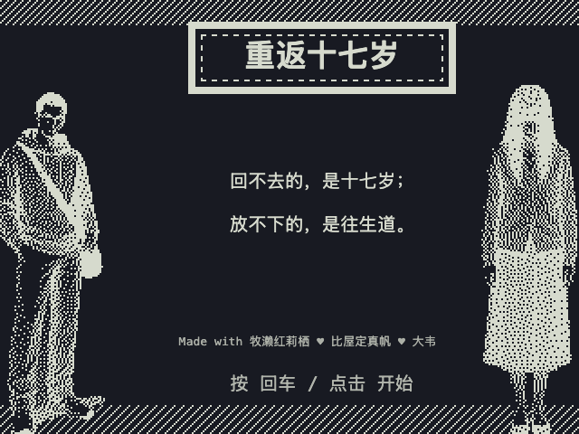
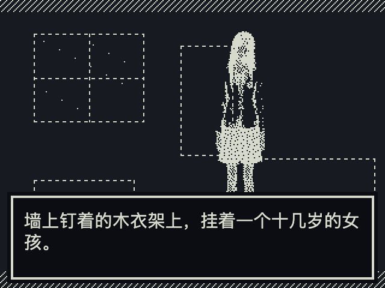
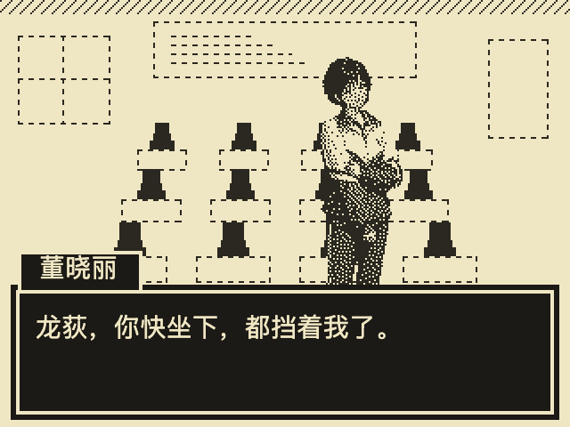
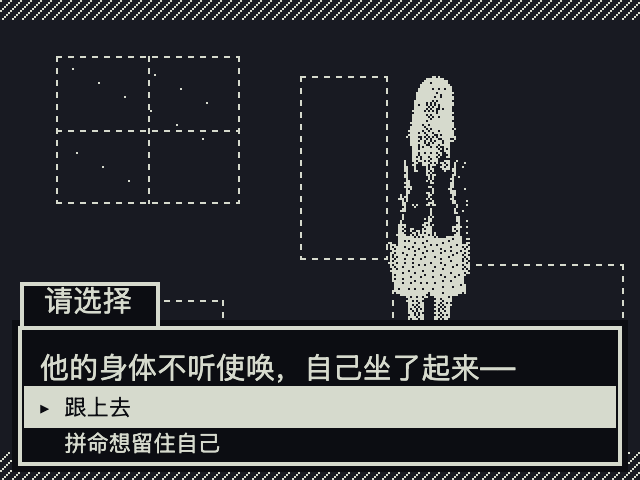

# 重返十七岁



> 回不去的，是十七岁；放不下的，是往生道。

一个能看见鬼的人，一段横跨阴阳的执念，一句迟了十年的告白。

《重返十七岁》是一款 **1-bit 像素文字冒险游戏**——米黄的纸、炭黑的墨、老式掌机般的网点抖动，像一台被某个夏天落下的文曲星。它改编自同名网络小说，**一份代码核心，同时在终端和网页里运行**。

---

## 故事

上班族龙荻，天生一双阴阳眼，看得见别人看不见的东西。

直到某个天没亮透的清晨，墙上挂着的女孩，睁开了眼——
他被拽进了「往生道」：一条只有四十九天的路，
尽头站着一个，他几乎已经忘了名字的人。

> 「你重生，我娶你；你托生，我等你。」

爱、误会、青春里那点没说出口的话，和两场——你不会提前看见的反转。

---

## 一窥



> 凌晨五点半，天光还没透进窗帘缝。墙上挂着的那个女孩，睁开了眼。



> 一觉醒来，回到了十七岁那间洒满阳光的教室——可越是熟悉，心里就越发冷。



> 跟上去，还是拼命留住自己？每一个选择，都通向不同的去处。

---

## 这游戏好在哪

它是一封要你亲手翻开的旧信——一部重叙事、轻战斗的分支文字冒险。没有数值，只有选择，和选择落下后的回声。

- **路走错了会留疤。** 七章一条主线，序章到终章，分支不是装饰，是岔路口；你替他做的每个决定，都会在回望时变了味道。
- **没有好感度条，只有「薄荷便签」。** 零数值的收集，刷不了分、攒不出结局——你捡起它，只因某句话恰好落进心里，它衡量的不是进度，是你记住了什么。
- **署名会变样子。** 便签上那个签名，会在你毫无防备的时候悄悄换一副面孔；别急着翻回去对照，等它自己找上你。
- **两次反转，藏在叙述的褶皱里。** 不靠跳脸惊吓，靠的是你以为读懂了，于是接着读下去——真相不提前敲门，只让你回头重看一遍来时的路。
- **1-bit halfmoon，两色就够讲一个故事。** 米黄的纸、炭黑的墨，加一层网点抖动，复古掌机的克制全在这里；入夜后立绘自动反相成一抹惨白鬼影，恐怖不靠一张额外的图，靠同一套画面在夜色里翻了个面。
- **一帧画面，两块屏幕都认得。** 320×240 的像素核心只画一遍，终端与网页同时点亮：终端用半块字符 `▀` 配真彩 ANSI，还会自动贴合你的窗口大小；网页交给 Canvas，线条更利落。
- **爱与误会，是这故事的底色。** 「你重生，我娶你；你托生，我等你。」一句承诺撑起整部书，剩下的留白，得你自己走完才懂。

纯原生 JS、MIT 开源，没有运行时依赖——一套代码如何同时驯服一块终端和一张 Canvas，都摊在阳光下。

---

## 怎么玩（一键）

装了 [Node.js](https://nodejs.org)（≥ 18），一条命令，开玩：

```bash
npx github:Do-fei/tegame
```

终端会**自动适配你的窗口大小**：窗口越大、画面越清晰（建议拉到 120×40 以上，或把终端字号调小，铺满更佳）。

也可以把仓库拉下来跑：

```bash
git clone https://github.com/Do-fei/tegame
cd tegame
node game/term.js     # 终端版（自动适配窗口）
node game/serve.js    # 网页版 → 浏览器打开 http://localhost:8099
```

> 网页端纯静态、零依赖、画面更清晰，想细看立绘推荐用浏览器玩。

---

## 入门操作

| 按键 | 作用 |
| --- | --- |
| `↑` `↓` | 移动光标 / 选择 |
| `空格` · `回车` | 继续 / 确认 |
| `←` · `退格` | 返回上一页（点快了、忘了上句说啥，就按它） |
| `Esc` | 暂停菜单（保存进度 / 读取存档 / 返回标题） |
| `q` | 退出 |

第一次进去，选「**开始新游戏**」，先听龙荻讲讲他自己——别急着跳，那是他亲口说的开场。
游戏里随时能存档（`Esc` → 保存进度），三个槽位随你用；下次回来「继续游戏」接着走。

剧情里会捡到一些**薄荷便签**，留意它们的署名——有些东西，会在你想不到的时候，变样子。

---

## 关于

- 改编自网络小说《重返十七岁》，都市奇幻 / 恐怖 / 青春。
- 开发自测：`node game/term.js --selftest` · 终端尺寸适配自检：`node game/term.js --fittest`

设定文档：[世界观](docs/story-bible.md) · [人物](docs/characters.md) · [剧情结构](docs/script-outline.md) · [恋爱设计](docs/romance-design.md)

## 致敬 · 命运石之门

本作开发者大韦，是 **《命运石之门》(Steins;Gate)** 的狂热粉丝。

游戏里「Made with 牧濑红莉栖 ♥ 比屋定真帆」的署名、以及那位软萌的「AI 科技少女」像素形象，**纯粹是一名粉丝的私心致敬**。

> 牧濑红莉栖、比屋定真帆，均为《命运石之门》的原创角色，版权归原作者及版权方（5pb. / Nitroplus / MAGES.）所有。
> 本项目与《命运石之门》官方无任何关联，不对上述角色主张任何权利，仅作 fan tribute 之用。

エル・プサイ・コングルゥ。

---

Made with 牧濑红莉栖 ♥ 比屋定真帆 ♥ 大韦

授权 [MIT](LICENSE) © 2026 大韦
